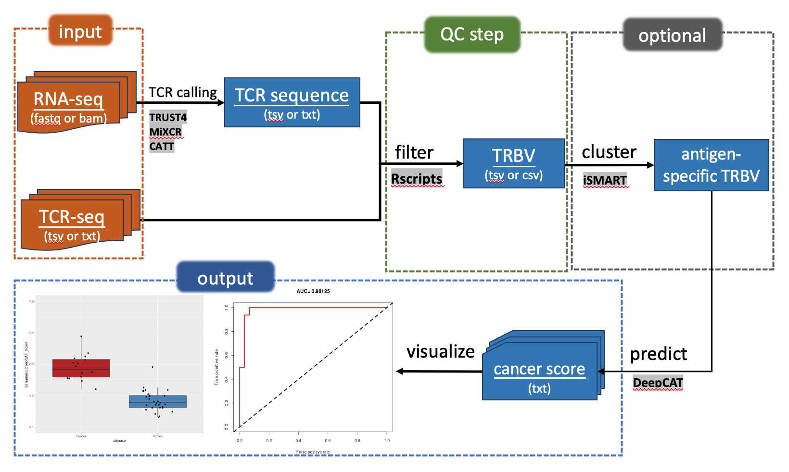
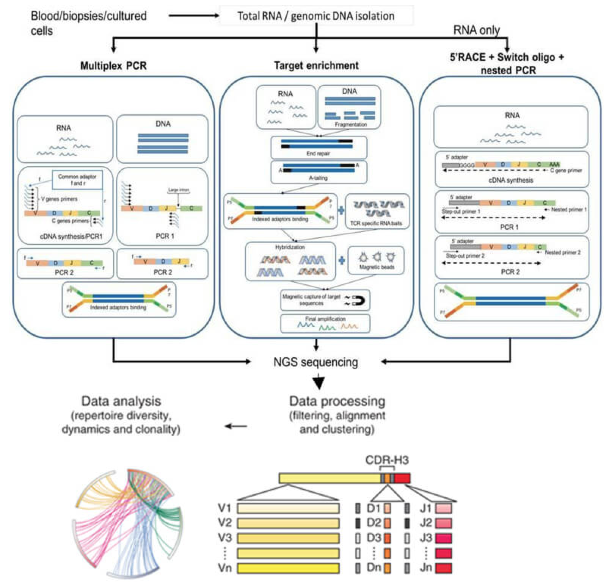

# Detect Cancer Associated TCR in Blood

本章主要介绍公共数据库中PBMC或tissue样本的TCR-seq，bulk RNA-seq数据和用于肿瘤分类的方法，包括 peak calling，filter，cluster, predict等步骤。

肿瘤微环境免疫在肿瘤发生和发展中起到关键作用，近年来随着液体活检的快速发展，人们能够在外周血中检测到各种来自肿瘤和周边免疫环境的信号，包括能够识别肿瘤新抗原 (neoantigen)的反应性T细胞，这使得直接基于外周血样本区分正常人群和无症状肿瘤早期人群的无创诊断 (non-invasive diagnosis)成为可能。
这里提供了一个整合了多种已发表方法的分析流程，基于PBMC的TCR-seq或bulk RNA-seq，检测外周血细胞中潜在的少量以caTCR(cancer-associated TCR)为代表的肿瘤免疫环境的信号。


## 1) Pipeline


## 2) Data Structure
### 2a) getting software & data
方法1: 使用docker
not distributed yet...

方法2: 自行下载和安装
```bash
git clone https://github.com/HUNNNGRY/TCR.git 
```


**data** ([download](https://cloud.tsinghua.edu.cn/library/14156f8d-93f5-496d-8837-90a8e0d24e4e/shared_data/))

1.TCR-seq dir
```./TCR/sample_data/PBMC_TCR-seq```

2.lulab RNA-seq dir
```./TCR/sample_data/PBMC_RNA-seq ```


**software/env requirement**

1. anaconda3

```bash
conda create -n TCR python==3.7 biopython tensorflow==1.14 matplotlib scikit-learn -y
# activate TCR env;激活配置的TCR环境
source activate TCR
```

2. TRUST4

```bash
cd ./TCR/packages/TRUST4/
make
cd -
cd ./TCR
```

environment configuration see 
[https://github.com/liulab-dfci/TRUST4](https://github.com/liulab-dfci/TRUST4)

3. DeepCAT

[https://github.com/HUNNNGRY/DeepCAT](https://github.com/HUNNNGRY/DeepCAT)

original repo: [https://github.com/s175573/DeepCAT](https://github.com/s175573/DeepCAT)

4. iSMART

original repo: [https://github.com/s175573/iSMART](https://github.com/s175573/iSMART)

### 2b) input
* pre-processed tsv TCR-seq file from adaptativebiotech

or

* raw fastq file from PBMC RNA seq

### 2c) output
* cancer score: DeepCAT CNN model prediction
* visualization: box plot and ROC curve 

## 3) Running Steps
Enter into bash interface, make sure you are in TCR dir and under TCR conda env
进入bash终端，确保当前路径在TCR目录，且已激活TCR的conda环境
### Option1: Using PBMC TCR-seq as input

1. view TCR_input data
```bash
# check header
head ./sample_data/PBMC_TCR-seq/HIP09046.tsv 
# count row number
wc -l ./sample_data/PBMC_TCR-seq/control/HIP09046.tsv
```

2. make working directory tree 
```bash
mkdir -p ./test_PBMC_TCR-seq/{01_filter_output,02_cluster_output,03_deepcat_output}
mkdir -p ./test_PBMC_TCR-seq/{01_filter,02_cluster}_output/{disease,control}
```

3. filter/prepare input  
```bash
# filter invalid TCR sequence, using TCRB V region CDR3 sequence only
python ./PrepareAdaptiveFile_corrected.py ./sample_data/PBMC_TCR-seq/disease   ./test_PBMC_TCR-seq/01_filter_output/disease
python ./PrepareAdaptiveFile_corrected.py ./sample_data/PBMC_TCR-seq/control   ./test_PBMC_TCR-seq/01_filter_output/control

# keep an eye on the change of row/record number;留意查看filter前后行数（TCR）的数目变化 
wc -l ./test_PBMC_TCR-seq/01_filter_output/control/TestReal-HIP09046.tsv
```

4. cluster using iSMART

```bash
# cluster similar TCR sequences using iSMART;使用iSMART聚类
python ./iSMARTv3.py -d ./test_PBMC_TCR-seq/01_filter_output/disease -o ./test_PBMC_TCR-seq/02_cluster_output/disease

python ./iSMARTv3.py -d ./test_PBMC_TCR-seq/01_filter_output/control -o ./test_PBMC_TCR-seq/02_cluster_output/control

# keep an eye on the change of row/record number;留意查看cluster前后行数（TCR）的数目变化 
wc -l ./test_PBMC_TCR-seq/02_cluster_output/control/TestReal-HIP09046.tsv_ClusteredCDR3s_7.5.txt
```

5. predict cancer score(probability) using DeepCAT

```bash
# 预测肿瘤样本组和对照样本组
bash  ./Script_DeepCAT.sh -t ./test_PBMC_TCR-seq/02_cluster_output/disease 
bash  ./Script_DeepCAT.sh -t ./test_PBMC_TCR-seq/02_cluster_output/control
# note:
# 注意命令最后不要加“/”
# 成功后当前文件夹会产生两个txt文件，分布记录肿瘤和对照组的不同样本的预测分数

# 查看样本肿瘤预测得分
head ./Cancer_score_control.txt
head ./Cancer_score_disease.txt

# 把预测结果放入输出目录中
mv ./Cancer_score_{control,disease}.txt ./test_PBMC_TCR-seq/03_deepcat_output
```

6. visualize cancer score result

```bash
# make boxplot and ROC curve using Rscripts;利用已有脚本画boxplot和ROC curve
Rscript ./plot.R ./test_PBMC_TCR-seq/03_deepcat_output
# note:
# 可能会因为部分包没有安装而报错，按照提示缺什么装什么即可
# eg.  install.packages("ROCR")
# 生成的结果在./test_PBMC_TCR-seq/03_deepcat_output路径下
```

* boxplot横坐标两列分别代表肿瘤和对照组，纵坐标是一个样本（每个点）的cancer score
* ROC曲线用于分类效果的评估，线下面积越接近1（越接近左上角）说明分类效果越好


### Option2: Using PBMC RNA-seq as input
总体上PBMC RNA-seq作为input和上一步TCR-seq相似，主要差别在于
* 需要先用TRUST4从RNA-seq中得到包含TCR序列的文件
* 由于RNA-seq是非靶向测序，得到的TCR记录可能会很少，这里统一不再经过聚类步骤而直接用DeepCAT预测

1. make working directory tree 

```bash
# 确认当前路径在DeepCAT目录中
mkdir -p ./test_PBMC_RNA-seq/{01_TCRcalling_output,02_filter_output,03_deepcat_output}
mkdir -p ./test_PBMC_RNA-seq/{01_TCRcalling,02_filter}_output/{disease,control}
```

2. TCR calling

```bash
# 从fastq(.gz)原始文件得到TCR序列信息
./packages/TRUST4/run-trust4  -1 controlID_1.fastq.gz -2 controlID_2.fastq.gz -f ./reference/TRUST4/hg38_bcrtcr.fa --ref ./reference/TRUST4/human_IMGT+C.fa -t 4 -o ./test_PBMC_RNA-seq/01_TCRcalling_output/control/controlID

# 本步骤运行以常见的双端测序PE的原始文件作为输入文件，得到的只是单一样本的TRUST4 TCR calling输出文件，对于其他样本可以用for loop循环执行,如：
for idx in `cat list.txt`;
do 
./packages/TRUST4/run-trust4  -1 ${idx}_1.fastq.gz -2 ${idx}_2.fastq.gz -f ./reference/TRUST4/hg38_bcrtcr.fa --ref ./reference/TRUST4/human_IMGT+C.fa -t 4 -o ./test_PBMC_RNA-seq/01_TCRcalling_output/${idx} ;
done

# view TRUST4 TCR calling output data;留意查看TRUST4后的行数（TCR）的数目
head ./test_PBMC_RNA-seq/01_TCRcalling_output/disease/CRC-2415350_report.tsv
wc -l ./test_PBMC_RNA-seq/01_TCRcalling_output/disease/CRC-2415350_report.tsv
```

**note: 由于本步骤需要一定时间，可以考虑直接从已有TRUST4 TCR calling输出文件开始下一步,把```./sample_data/PBMC_RNA-seq/```目录下的文件全部移动到```./test_PBMC_RNA-seq/01_TCRcalling_output/```目录下即可**

3. filter/prepare input  

```bash
# filter invalid TCR sequence, using TCRB V region CDR3 sequence only
# For循环分别过滤疾病和对照组的所有样本 (最好提前准备含有sampleID的文件)
for idx in `cat ./test_PBMC_RNA-seq/01_TCRcalling_output/diseaseID.txt`
do
Rscript ./filter_TRUST4.R ./test_PBMC_RNA-seq/01_TCRcalling_output/disease   ./test_PBMC_RNA-seq/02_filter_output/disease ${idx}
done

for idx in `cat ./test_PBMC_RNA-seq/01_TCRcalling_output/controlID.txt`
do
Rscript ./filter_TRUST4.R ./test_PBMC_RNA-seq/01_TCRcalling_output/control   ./test_PBMC_RNA-seq/02_filter_output/control ${idx}
done

# keep an eye on the change of row/record number;留意查看filter前后行数（TCR）的数目变化 
wc -l ./test_PBMC_RNA-seq/02_filter_output/disease/CRC-2415350_report_filter.tsv
```

**note: 注意这里用于过滤的是R脚本filter_TRUST4.R, 而不是之前的python脚本PrepareAdaptiveFile_corrected.py**

4. predict cancer score(probability) using DeepCAT
```bash
# 与TCR-seq相同，只是注意因为RNA-seq没有聚类，这里DeepCAT的input目录是./test_PBMC_RNA-seq/02_filter_output，而不是之前的./test_PBMC_TCR-seq/02_cluster_output
bash  ./Script_DeepCAT.sh -t ./test_PBMC_RNA-seq/02_filter_output/disease 

bash  ./Script_DeepCAT.sh -t ./test_PBMC_RNA-seq/02_filter_output/control

mv ./Cancer_score_{control,disease}.txt ./test_PBMC_RNA-seq/03_deepcat_output
```

5. visualize cancer score result
```bash
# 与TCR-seq相同
Rscript ./plot.R ./test_PBMC_RNA-seq/03_deepcat_output
```


## 4) Tips/Utilities

**Wiki**
* Liquid biopsy
A liquid biopsy, also known as fluid biopsy or fluid phase biopsy, is the sampling and analysis of non-solid biological tissue, primarily blood. Like traditional biopsy this type of technique is mainly used as a diagnostic and monitoring tool for diseases such as cancer, with the added benefit of being largely non-invasive.
* PBMC
A peripheral blood mononuclear cell (PBMC) is any peripheral blood cell having a round nucleus. These cells consist of lymphocytes (T cells, B cells, NK cells) and monocytes, whereas erythrocytes and platelets have no nuclei, and granulocytes (neutrophils, basophils, and eosinophils) have multi-lobed nuclei. 
* TCR
The T-cell receptor (TCR) is a protein complex found on the surface of T cells, or T lymphocytes, that is responsible for recognizing fragments of antigen as peptides bound to major histocompatibility complex (MHC) molecules.
* CDR3
Complementarity-determining regions (CDRs) are part of the variable chains in immunoglobulins (antibodies) and T cell receptors, generated by B-cells and T-cells respectively, where these molecules bind to their specific antigen.
There are three CDRs (CDR1, CDR2 and CDR3), arranged non-consecutively, on the amino acid sequence of a variable domain of an antigen receptor.
CDR3 is the most variable.
* Immune repertoire
The immune repertoire encompasses the different sub-types an organism's immune system makes of immunoglobulins or T-cell receptors. These help recognise pathogens in most vertebrates. The sub-types, all differing slightly from each other, can amount to tens of thousands, or millions in a given organism. Such a wide variety increases the odds of having a sub-type that recognises one of the many pathogens an organism may encounter.
* neoantigen
Neoantigens are mutated antigens specifically expressed by tumor tissue and are not expressed on the surface of normal cells. Development of sequencing technology has improved the accuracy of identification and localization of neoantigens.
* RNA-seq
RNA-Seq (named as an abbreviation of "RNA sequencing") is a particular technology-based sequencing technique which uses next-generation sequencing (NGS) to reveal the presence and quantity of RNA in a biological sample at a given moment, analyzing the continuously changing cellular transcriptome.
* TCR-seq
TCR-seq using multiple-PCR, 5' RACE or target enrichment methods, followed by deep sequencing and data analysis.



**Reference**
* TRUST4: [Ultrasensitive detection of TCR hypervariable-region sequences in solid-tissue RNA–seq data](https://www.nature.com/articles/ng.3820)
* iSMART: [Investigation of Antigen-Specific T-Cell Receptor Clusters in Human Cancers](https://clincancerres.aacrjournals.org/content/26/6/1359)
* DeepCAT: [De novo prediction of cancer-associated T cell receptors for noninvasive cancer detection](https://stm.sciencemag.org/content/12/557/eaaz3738)


> if you want to exercise with raw fastq input with out RNA-seq pipeline, please download raw data in [here](https://cloud.tsinghua.edu.cn/library/14156f8d-93f5-496d-8837-90a8e0d24e4e/shared_data/) (Tsinghua cloud)
or ```/BioII/lulab_b/wangsiqi/exRNA/exRNA-panel/pico/02.rawdata_PBMC```


## 5) Homework

1. Finish above 2 pipeline using provided input

2. Compare output between TCR-seq and RNA-seq, which sequencing methods perform better in cancer diagnosis and why, please summarize (dis)advantages of both sequencing methods.
